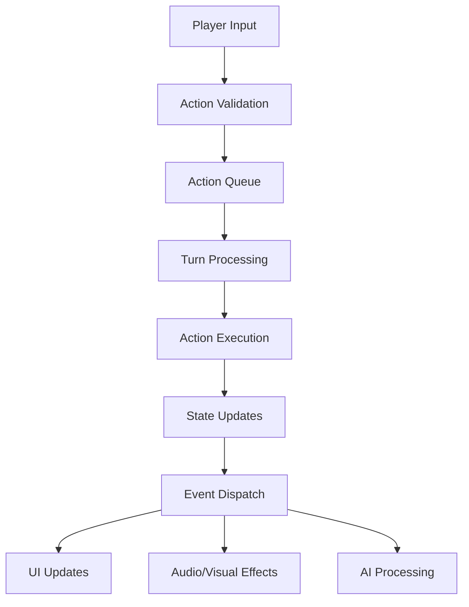

# Core Design Document

## 🎯 Vision Statement

Create a modular, extensible combat system that provides engaging tactical gameplay while maintaining excellent performance and clear, predictable mechanics.

## 🏗️ System Architecture

### High-Level Components

#### 1. Combat Engine Core
```
CombatEngine
├── TurnManager
├── ActionResolver
├── StateManager
└── EventDispatcher
```

**Responsibilities:**
- Orchestrate combat flow
- Manage turn order and timing
- Process and validate actions
- Maintain combat state
- Dispatch events to other systems

#### 2. Entity Management
```
EntityManager
├── CharacterRegistry
├── ComponentSystem
└── EntityFactory
```

**Responsibilities:**
- Track all combat participants
- Manage entity lifecycle
- Handle component composition
- Provide entity queries and lookups

#### 3. Action System
```
ActionSystem
├── ActionQueue
├── ActionValidator
├── ActionExecutor
└── ActionHistory
```

**Responsibilities:**
- Queue and prioritize actions
- Validate action legality
- Execute actions with proper timing
- Maintain action history for replays

### Data Flow



## 🎮 Combat Flow

### Turn-Based Combat Flow
1. **Initiative Phase**: Determine turn order
2. **Action Selection**: Current actor chooses action
3. **Validation**: Verify action legality
4. **Resolution**: Execute action and apply effects
5. **State Update**: Update all affected entities
6. **Event Broadcast**: Notify interested systems
7. **Next Turn**: Advance to next actor

### Real-Time Combat Flow
1. **Continuous Input**: Accept player inputs at any time
2. **Action Queuing**: Queue actions with timestamps
3. **Priority Processing**: Process actions by priority and timing
4. **Immediate Resolution**: Execute actions as they become available
5. **Continuous Updates**: Update state and UI continuously

## 🧩 Component Architecture

### Entity-Component-System (ECS) Design

#### Core Components
- **Transform**: Position, rotation, scale
- **Health**: Current/max HP, damage resistance
- **Attributes**: Strength, dexterity, intelligence, etc.
- **Actions**: Available abilities and their states
- **Status**: Active buffs, debuffs, conditions
- **AI**: Behavior patterns and decision logic
- **Animation**: Visual state and transitions
- **Audio**: Sound effect triggers and states

#### System Examples
- **MovementSystem**: Handles position changes
- **DamageSystem**: Processes damage calculations
- **StatusSystem**: Manages temporary effects
- **AnimationSystem**: Controls visual animations
- **AISystem**: Drives non-player character behavior

## ⚡ Performance Considerations

### Optimization Strategies

#### Memory Management
- Object pooling for frequently created/destroyed entities
- Component arrays for cache-friendly iteration
- Lazy loading of non-essential data

#### Processing Optimization
- Spatial partitioning for range queries
- Delta time processing for smooth frame rates
- Predictive loading for AI decisions
- Batch processing of similar operations

#### Scalability
- Configurable LOD (Level of Detail) systems
- Dynamic loading/unloading of combat areas
- Hierarchical AI processing (different update frequencies)

## 🔧 Configuration System

### Data-Driven Design

#### Configuration Files
- **combat-rules.json**: Core combat mechanics
- **character-classes.json**: Class definitions and abilities
- **damage-tables.json**: Damage calculations and modifiers
- **ai-behaviors.json**: AI behavior patterns
- **balance-values.json**: Numerical balance parameters

#### Runtime Modification
- Hot-reloading of configuration files
- In-game balance adjustment tools
- A/B testing framework for balance changes

## 🎯 Design Patterns

### Command Pattern
- Actions as command objects
- Undo/redo functionality
- Action queuing and scheduling

### Observer Pattern
- Event-driven architecture
- Loose coupling between systems
- Extensible notification system

### State Machine
- Character state management
- Combat phase transitions
- Animation state control

### Factory Pattern
- Entity creation
- Ability instantiation
- Effect generation

## 🔒 Data Integrity

### Validation Layers
1. **Client-side**: Immediate feedback, basic validation
2. **Server-side**: Authoritative validation, cheat prevention
3. **Rule Engine**: Complex rule validation
4. **Consistency Checks**: State coherency verification

### Error Handling
- Graceful degradation for invalid states
- Recovery mechanisms for corrupted data
- Detailed logging for debugging
- Fallback behaviors for edge cases

## 🧪 Testing Strategy

### Unit Testing
- Individual component testing
- Action validation testing
- Damage calculation verification
- AI behavior testing

### Integration Testing
- System interaction testing
- End-to-end combat scenarios
- Performance benchmarking
- Memory leak detection

### Simulation Testing
- Automated combat simulation
- Balance verification
- Edge case discovery
- Performance stress testing

---

*This document outlines the fundamental architecture and design principles for the combat system. It serves as a foundation for all other design documents.*